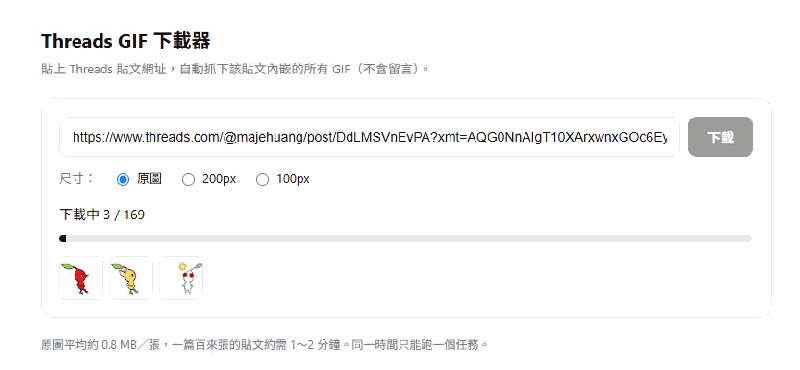

# Threads GIF Downloader

貼上 Threads 貼文網址，把該貼文內嵌的所有 GIF 一次抓到本機。

Threads 貼文裡的 GIF 多半是 Giphy 貼圖，而且一篇可能內嵌上百個。
這個工具會讀出貼文（**不含留言**）裡的所有 Giphy GIF，依貼文順序編號存檔，
並順便打包 zip、產生一張總覽圖。

## 畫面



## 使用方式

### 免安裝版（推薦，不需要安裝 Node.js）

到 [Releases](../../releases) 下載 `ThreadsGIF-Downloader-portable.zip`，
**解壓縮後雙擊裡面的 exe** 就能用。Node.js 已經包在裡面，不必另外安裝任何東西。

程式會常駐在系統列（右下角），瀏覽器自動開啟操作介面。
右鍵系統列圖示可以開啟介面、開啟下載資料夾，或結束程式。

需求：Windows 10/11（64 位元），以及 **Microsoft Edge 或 Google Chrome** 其中之一
—— Windows 10/11 內建 Edge，一般不用特別處理。

> 執行檔沒有程式碼簽章，Windows SmartScreen 會攔一次
> （點「其他資訊」→「仍要執行」）。

### 從原始碼執行

```bash
cd app
npm install
npm start
```

瀏覽器會自動開啟 `http://127.0.0.1:5123`。貼上網址、選尺寸、按下載。

預設會使用系統上的 Edge 或 Chrome；想改用 Playwright 自己的 Chromium
就執行 `npx playwright install chromium`。

啟動程式想自己編譯的話，用 Windows 內建的編譯器即可，不需安裝任何開發工具：

```
C:\Windows\Microsoft.NET\Framework64\v4.0.30319\csc.exe -nologo -target:winexe ^
  -optimize+ -r:System.Drawing.dll -r:System.Windows.Forms.dll ^
  -out:"Threads GIF 下載器.exe" app\launcher\Launcher.cs
```

編好的 exe 要放在 `app/` 資料夾的**上一層**（和 `app/` 並排）。
檔名可以自己改，程式只認旁邊有沒有 `app/` 資料夾。

### 自行建置免安裝版

```powershell
.\build-portable.ps1
```

會自動編譯啟動程式、複製 `node.exe` 與精簡過的相依套件，產出：

```
dist/ThreadsGIF-Downloader-portable/      解壓後的樣子（約 136 MB）
dist/ThreadsGIF-Downloader-portable.zip   要上傳到 Release 的檔案（約 48 MB）
```

前置條件：已安裝 Node.js，且 `app/` 內已執行過 `npm install`。

### 命令列

```bash
node app/get-thread-gif.js "https://www.threads.com/@USERNAME/post/POSTCODE" [輸出資料夾] [--size=orig|200|100]
```

## 輸出

```
downloads/<貼文代碼>/
├── 001_xxxxxxxx.gif      # 依貼文中的順序編號
├── ...
├── <貼文代碼>.zip          # 全部打包
└── <貼文代碼>_overview.png # 每張第一格拼成的總覽圖
```

尺寸選項：`orig`（原圖，約 0.8 MB/張）、`200`（200px）、`100`（100px）。

## 運作方式

Threads 的貼文內容是前端動態載入的，匿名 `curl` 只會拿到登入頁，
所以這裡用 Playwright 開無頭瀏覽器讀渲染後的 DOM。
瀏覽器會依序嘗試：附帶的 Chromium → 系統的 Edge → 系統的 Chrome → Playwright 預設，
因此免安裝版不需要另外下載 Chromium（省下約 270 MB）。

定位主貼文的方式：找到指向該貼文的時間戳連結，往上取「還沒包含其他貼文連結」
的最大祖先節點 —— 這樣就能精準圈出主貼文而排除所有留言。
取得 Giphy ID 後，直接從 Giphy CDN 下載（6 條併發，失敗自動重試 3 次）。

## 專案結構

```
Threads GIF 下載器.exe   # 系統列啟動程式（Release 下載，或自行編譯）
app/
├── server.js            # 本機伺服器 + SSE 進度推播（僅綁定 127.0.0.1）
├── lib.js               # 擷取 + 併發下載核心
├── postprocess.js       # zip 打包 / 總覽圖
├── get-thread-gif.js    # CLI
├── public/index.html    # 網頁介面
└── launcher/Launcher.cs # 啟動程式原始碼
downloads/               # 輸出（已 gitignore）
```

## 免責聲明

- Threads 的服務條款禁止未經許可的自動化存取。使用本工具可能違反該條款，
  相關風險（例如帳號被限制）由使用者自行承擔。
- 下載的 GIF 版權屬於原創作者與 Giphy。請僅供個人使用，不要再散布。
- 本專案不包含任何 GIF 內容，只有程式碼。

## 授權

[MIT](LICENSE)
